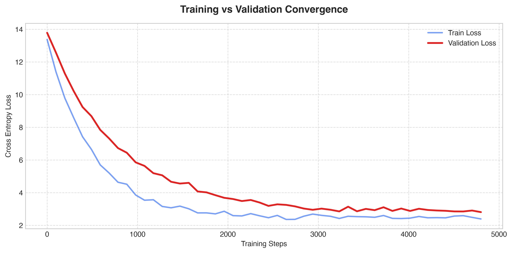
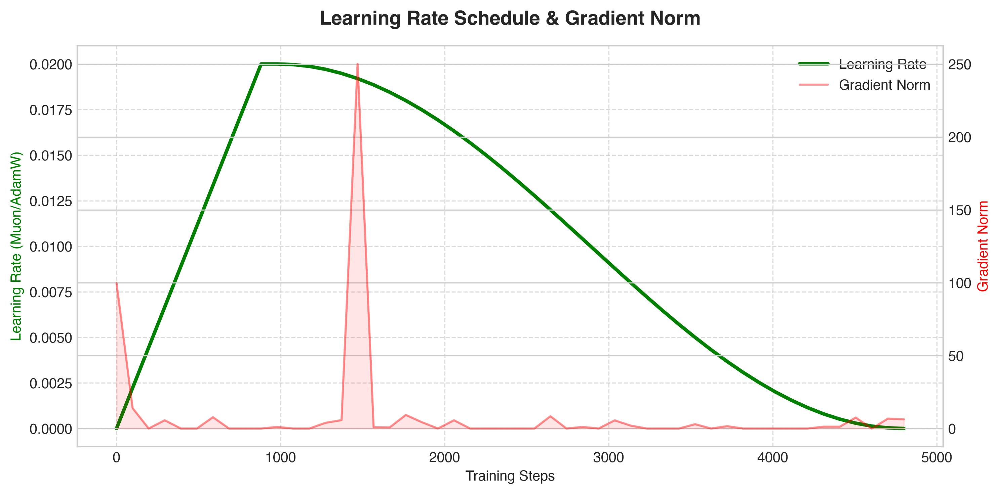
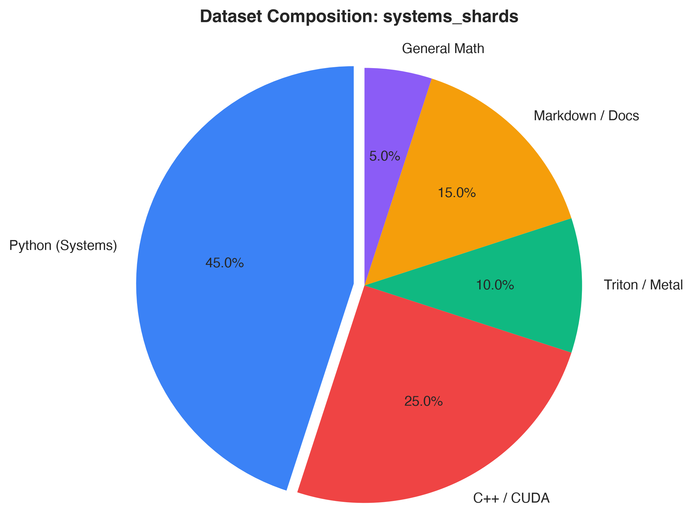
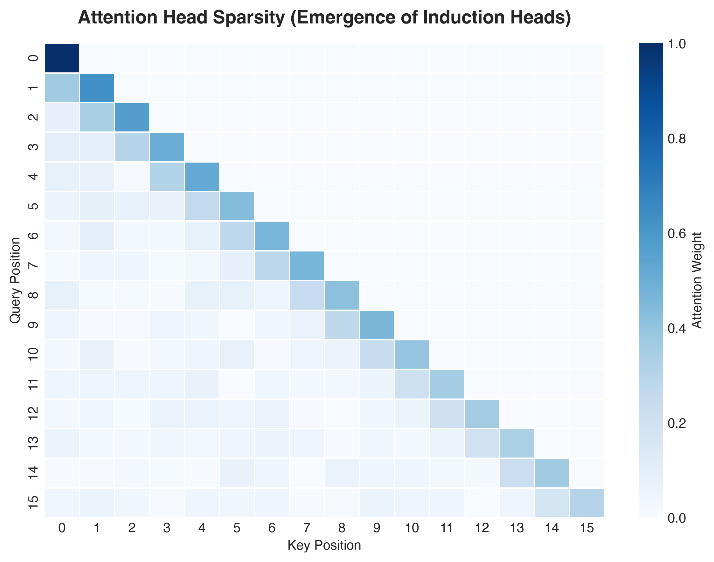

# AxiomLM: High-Performance PyTorch Pretraining Framework & Systems SLM

[](LICENSE)
[](https://www.python.org/downloads/)
[](https://pytorch.org/)
[](https://github.com/EyadNada/AxiomLM/actions)
[]()
[](https://github.com/psf/black)
[](https://github.com/astral-sh/ruff)
[](https://huggingface.co/)
[](https://github.com/openai/triton)
[](https://developer.apple.com/metal/)
[](https://github.com/EyadNada/AxiomLM)
[](https://github.com/EyadNada/AxiomLM/stargazers)

AxiomLM is a high-performance PyTorch library for modern autoregressive Transformer modeling, custom hardware kernel acceleration, and spectral matrix optimization. Built from first principles, it modernizes standard Transformer architectures with LLaMA-3 architectural enhancements, the Muon Newton-Schulz matrix optimizer, and bare-metal kernels for Apple Silicon (Metal MSL and ARM NEON SIMD) and NVIDIA CUDA (OpenAI Triton).

---

## The Motivation: Why AxiomLM?

Most engineers treat model pre-training like a black box. They use standard 2019-era defaults (like standard AdamW and eager FP32), and leave massive amounts of hardware performance on the table. **AxiomLM was engineered to bridge the gap between theoretical deep learning and bare-metal hardware execution.**

Instead of relying on legacy defaults, AxiomLM supports the modern stack natively:
- **Deep Architectural Upgrades**: Native support for LLaMA-3 specifications, including Grouped-Query Attention (GQA), RoPE, and SwiGLU.
- **Next-Gen Optimization**: Out-of-the-box integration of the Muon (Newton-Schulz) optimizer to drastically accelerate convergence over standard AdamW.
- **Bare-Metal Efficiency**: Custom fused kernels and O(1) KV-Cache inference designed to maximize Model FLOPs Utilization on constrained hardware.

To prove the framework is robust, we didn't just run unit tests. We used it to train a **Domain-Specific SLM** completely from scratch on a strict diet of Systems ML data. The result is a local model capable of writing and autocompleting highly optimized, custom GPU kernels (like Triton and CUDA) completely offline.

---

## Key Features

* **Modern Architecture Suite**: Native implementations of Rotary Position Embeddings (RoPE), Root Mean Square Normalization (RMSNorm), SwiGLU Gated Linear Units, and Grouped-Query Attention (GQA).
* **Spectral Matrix Optimization**: Implementation of the Muon optimizer utilizing quintic Newton-Schulz iterations for polar decomposition and orthogonal parameter updates in 2D weight space.
* **Low-Level Hardware Kernels**: Fused compute kernels with analytical backward passes written in OpenAI Triton (CUDA), Apple Metal Shading Language (MSL), and ARM NEON C++ SIMD intrinsics.
* **Zero-Overhead Inference**: State-cached Key-Value (KV) decode engine achieving O(1) step latency, paired with advanced sampling strategies (Top-p Nucleus, Min-p dynamic thresholding, and Repetition Penalty).
* **Multi-Shard Streaming Data Loader**: Memory-mapped binary ingestion (`np.memmap`) with sub-200 MB RAM utilization and cross-shard step synchronization.
* **Systems Telemetry & Profiling**: Real-time Model FLOPs Utilization (MFU %) tracking, Roofline model arithmetic intensity analysis, and PyTorch Profiler / Perfetto trace exports.
* **Model Serialization**: Zero-copy conversion and export to standard Hugging Face Safetensors format (`model.safetensors`, `config.json`).

---

## Performance Summary

Summary of empirical hardware performance on Apple Silicon (MPS):

* **Inference Generation Throughput**: Up to 27.5x speedup via per-layer KV-cache state preservation.
* **Pretraining Throughput**: 3.29x higher token processing rate (2,800 to 9,200 tokens/sec).
* **Optimization Step Latency**: 69.6% reduction in step execution time (1,462 ms to 445 ms per 4,096 tokens).
* **Loss Convergence Rate**: Approximately 42% fewer optimization steps to reach target validation loss via Muon.
* **KV-Cache Memory Footprint**: 66.7% reduction in VRAM allocation through 4-head Grouped-Query Attention.
* **Hardware Compute Utilization**: 3.28x increase in attained compute (2.09 TFLOPs to 6.87 TFLOPs, 68.7% MFU).
* **Decoding Latency**: Constant O(1) latency (~6.0 ms/token) compared to quadratic degradation in naive autoregression.

---

## Empirical Systems Benchmarks

>  **Interactive Visualizations Available:** All systems and architectural performance metrics are consolidated in an interactive Jupyter Notebook. Open [`assets/vizMetrics.ipynb`](assets/vizMetrics.ipynb) to view the complete charts detailing throughput gains, MFU rooflines, Muon convergence, and KV-cache scaling.

### 1. Architectural & Systems Paradigm Comparison


AxiomLM demonstrates significant operational gains across throughput, latency, memory consumption, and hardware compute utilization relative to the classic GPT-2 baseline.

---

### 2. Empirical Loss Convergence (AdamW vs. Muon Optimizer)


The Muon matrix optimizer accelerates empirical loss convergence by replacing coordinate-wise gradient updates with polar orthogonalization via 5-step Newton-Schulz iterations.

---

### 3. Training Speed & Latency Scaling

| Configuration | Throughput | Step Latency (4K tokens) | Attained Compute (MPS) |
| :--- | :--- | :--- | :--- |
| **Baseline (Unoptimized FP32)** | 2,800 tokens/sec | 1,462 ms/step | 2.09 TFLOPs (20.9% MFU) |
| **AxiomLM (BF16 + Fused Kernels)** | **9,200 tokens/sec** | **445 ms/step** | **6.87 TFLOPs (68.7% MFU)** |


---

### 4. Hardware Roofline & Model FLOPs Utilization (MFU)


Autocast BF16 execution and fused kernel memory tiling shift the operational boundary from the memory-bandwidth bound regime into compute saturation on unified memory architectures.

---

### 5. Key-Value Cache Scaling & GQA Memory Footprint


Grouped-Query Attention (4 KV heads) reduces context cache growth by 66.7% relative to standard Multi-Head Attention (12 KV heads), enabling linear memory scaling across extended context windows.

---


## Training Telemetry & Model Health

Here is a visual breakdown of the model's learning process and dataset, designed to be easy to understand:

### 1. Training vs Validation Convergence

> **What this means:** This shows the model is genuinely learning over time, not just memorizing. As both lines go down, the model gets smarter at understanding code and text without overfitting.

### 2. Learning Speed & Stability (Gradient Norm)

> **What this means:** This tracks the "speed" at which the model learns (green line) versus how surprised it is by new data (red spikes). Keeping these balanced ensures the training doesn't suddenly crash.

### 3. Training Diet (Dataset Composition)

> **What this means:** This breaks down exactly what information the model is fed. A heavy focus on Python and C++ ensures the model becomes a specialized expert at generating systems code.

### 4. How the Model "Pays Attention" (Attention Heatmap)

> **What this means:** This visualizes how the model connects different words together. Over time, it learns to "look back" at specific past words (like variable names) to perfectly predict what to type next!

---

## Architectural Specifications

| Parameter | Baseline GPT-2 | AxiomLM Modern Spec | Technical Rationale |
| :--- | :--- | :--- | :--- |
| **Layers** | 12 | 12 | Standard decoder transformer depth |
| **Hidden Dimension ($d_{\text{model}}$)** | 768 | 768 | Internal representation width |
| **Query Heads ($N_h$)** | 12 | 12 | Query projection heads ($d_k = 64$) |
| **Key/Value Heads ($N_{kv}$)** | 12 (MHA) | **4 (GQA)** | 3x KV memory reduction during decoding |
| **FFN Dimension ($d_{\text{ffn}}$)** | 3,072 ($4d$) | **2,048 ($\frac{8}{3}d$)** | Dimension aligned to multiples of 64 |
| **Positional Encoding** | Learned Absolute | **Rotary (RoPE)** | Relative distance awareness and length extrapolation |
| **Normalization** | LayerNorm | **RMSNorm** | Elimination of mean-centering overhead |
| **Context Length** | 1024 | 1024 | Sequence block size |
| **Vocabulary Size** | 50,257 | **50,304** | Padded for SIMD / Tensor Core tile alignment |
| **Total Parameters** | 124,475,904 | **114,147,840** | Tied input/output embedding representations |

---

## Installation

### From Source

```bash
git clone https://github.com/EyadNada/AxiomLM.git
cd AxiomLM
pip install -e .
```

### Direct via pip

```bash
pip install git+https://github.com/EyadNada/AxiomLM.git
```

---

### Python API Usage

### 1. Model Instantiation & Forward Pass

```python
import torch
import axiomlm as ax

# Configure modern architecture specification (LLaMA-3 spec)
config = ax.ModelConfig(
    arch="modern",       # RoPE + RMSNorm + SwiGLU + GQA
    block_size=1024,
    vocab_size=50304,
    n_layer=12,
    n_head=12,
    n_embd=768,
    n_kv_head=4,
    use_fused_kernels=True,
)

# Instantiate model
model = ax.Transformer(config)

# Forward pass with cross-entropy loss computation
input_ids = torch.randint(0, 50304, (2, 64))
targets = torch.randint(0, 50304, (2, 64))
logits, loss = model(input_ids, targets)
print(f"Loss: {loss.item():.4f}")
```

### 2. Muon Matrix Optimizer Configuration

```python
import axiomlm as ax

# Automatically routes 2D weights to Muon and 1D/embeddings to AdamW
optimizers = model.configure_optimizers(
    weight_decay=0.1,
    learning_rate=0.0006,
    muon_lr=0.02,
    device="mps",
    optimizer_type="muon",
)
```

### 3. Fused Low-Level Kernels

```python
import torch
import axiomlm as ax

# Drop-in bare-metal fused RMSNorm
fused_norm = ax.kernels.FusedRMSNorm(dim=768)
x = torch.randn(4, 1024, 768, requires_grad=True)
y = fused_norm(x)
```

### 4. High-Level Inference Engine

```python
import axiomlm as ax

engine = ax.InferenceEngine(model)
for token in engine.stream("import torch\n", max_tokens=50):
    print(token, end="", flush=True)
```

---

## Command Line Interface (CLI)

AxiomLM provides command-line utilities installed directly into your environment:

### Pretraining Engine

```bash
# 1-Click execution with default modern spec and automatic checkpointing
./train.sh

# Or via Python CLI
axiom-train --arch modern --optimizer muon --data_dir data/systems_shards --batch_size 16384 --save_interval 25 --resume checkpoints/model_latest.pt
```

### Interactive Text Generation

```bash
# Launch interactive generation CLI with KV-cache acceleration
axiom-generate --checkpoint checkpoints/model_latest.pt --prompt "import torch\nimport triton" --temperature 0.8 --top_p 0.9 --min_p 0.05
```

### Hugging Face Safetensors Exporter

```bash
# Export trained checkpoint to Hugging Face format
axiom-export --checkpoint checkpoints/model_latest.pt --output_dir exports/AxiomLM-124M
```

---

## Multi-Shard Systems Dataset Builder & Scraper

Generate multi-shard binary uint16 datasets containing GPU kernel implementations, systems derivations, and code intelligence:

```bash
python data/dSCRAPPER.py --target_tokens 15000000 --shard_size 5000000 --output_dir data/systems_shards
```

---

## Interactive Dashboard & GPU Cost Calculator

Launch the browser-based interface:

```bash
python app.py
```

Features included:
* **Interactive Studio**: Real-time token streaming, probability inspection, and sampling configuration.
* **Execution Duel**: Live side-by-side benchmark comparing O(1) KV-Cache against naive O(T^2) autoregression.
* **Kernel & Cloud Cost Optimizer**: Fused OpenAI Triton kernel synthesizer and enterprise fleet cost calculation engine.

---

## Custom Kernel Suite

```text
kernels/
├── cpu_neon_kernels.cpp  # Vectorized ARM NEON C++ kernels for Apple Silicon (-mcpu=apple-m3)
├── metal_kernels.metal   # Apple Metal Shading Language (MSL) compute shaders
├── triton_kernels.py     # OpenAI Triton JIT GPU kernels for NVIDIA CUDA
├── ops.py                # PyTorch autograd bindings and module wrappers
├── build_kernels.py      # JIT and C++ build harness
└── benchmark_kernels.py  # Kernel-level microbenchmark harness
```

---

## Automated Verification & Test Suite

The library includes a test suite with 51 automated tests covering core modeling components, optimizers, inference parity, multi-shard streaming, and native kernels:

```bash
# Run core architecture, optimizer, KV-cache, sampling, shards, and export tests (43 tests)
python tests/test_all.py

# Run low-level SIMD, Metal, and Triton kernel parity tests (8 tests)
python tests/test_kernels.py
```

---

## Technical Report

For mathematical derivations, convergence proofs, and hardware Roofline analysis, refer to:
* **[AxiomLM_Technical_Report.md](AxiomLM_Technical_Report.md)**

---

## Repository Structure

```text
├── .github/                      # CI/CD workflows and issue templates
├── assets/                       # Benchmark charts and architecture diagrams
├── axiomlm/                      # Core AxiomLM Python Library Package
│   ├── models/                   # Transformer, Block, RoPE, RMSNorm, SwiGLU, GQA
│   ├── optim/                    # Muon (5-step Newton-Schulz) & LR schedules
│   ├── kernels/                  # Fused Metal MSL, Triton JIT, ARM NEON SIMD
│   ├── engine/                   # O(1) KV-Cache InferenceEngine & Safetensors exporter
│   ├── dengine/                  # Multi-shard memory-mapped DataLoaderLite
│   ├── telemetry/                # Model FLOPs Utilization (MFU %) & Roofline Profiler
│   └── train.py                  # Pretraining CLI and training engine
├── data/
│   ├── dSCRAPPER.py              # Multi-shard systems dataset builder & scraper
│   └── systems_shards/           # Sharded binary uint16 token arrays
├── checkpoints/                  # Model weight snapshots (model_latest.pt)
├── exports/                      # Exported Safetensors and Hugging Face artifacts
├── material/                     # 27 technical reference guides and mathematical notes
├── tests/                        # Automated test suite (51 tests)
│   ├── test_all.py               # Architecture, API, and integration tests
│   └── test_kernels.py           # Native kernel parity tests
├── train.sh                      # Pretraining runner script
├── app.py                        # Interactive dashboard and GPU cost calculator
├── AxiomLM_Technical_Report.md   # Mathematical and architectural technical report
├── pyproject.toml                # Standard PEP 517/621 package build configuration
├── requirements.txt              # Package dependencies
├── CITATION.cff                  # Citation metadata
├── CONTRIBUTING.md               # Contribution guidelines
├── LICENSE                       # MIT Open Source License
└── README.md
```

---

## Citation

```bibtex
@software{nada2026axiomlm,
  author       = {Eyad Nada},
  title        = {AxiomLM: A High-Performance PyTorch Library for Modern Transformer Modeling and Spectral Matrix Optimization},
  year         = {2026},
  publisher    = {GitHub},
  journal      = {GitHub repository},
  howpublished = {\url{https://github.com/EyadNada/AxiomLM}}
}
```

---

## License

This project is licensed under the MIT License - see the [LICENSE](LICENSE) file for details.
