# AxiomLM(124mill)

What's AxiomLM? Why AxiomLM? its a high-performance pretraining engine and modern architectural redesign of OpenAI's original GPT2 124M parameter autoregressive Transformer, optimized for Apple Silicon (Metal Performance Shaders / MPS) and NVIDIA CUDA.

---

## Technical Specifications

| Parameter | Symbol | Value | Notes |
| :--- | :---: | :---: | :--- |
| **Layers** | $L$ | 12 | Stacked decoder transformer blocks |
| **Hidden Dimension** | $d_{\text{model}}$ | 768 | Model embedding dimension |
| **Attention Heads** | $N_h$ | 12 | Query heads ($d_k = 64$) |
| **KV Heads (GQA)** | $N_{kv}$ | 4 | Grouped-Query Attention (Modern spec) |
| **Context Length** | $T$ | 1024 | Maximum sequence length |
| **Vocabulary Size** | $V$ | 50,304 | GPT-2 BPE vocabulary (padded for Tensor Core / SIMD alignment) |
| **Total Parameters** | $P$ | 124,475,904 | Tied input/output embeddings (114.1M Modern GQA spec) |

---

## Performance Benchmarks

### 1. Architectural & Systems Paradigm Comparison

| Dimension / Metric |  2019 Baseline (GPT-2 / Eager FP32) |  2026 Axiom-LM (Modern Spec) | Impact / Multiplier |
| :--- | :--- | :--- | :--- |
| **Precision Execution** | Eager FP32 (Full 32-bit floats) | BF16 Mixed-Precision Autocast | **$2.0\times$ ALU Speed & Memory Efficiency** |
| **Attention Kernel** | Naive $O(T^2)$ Materialized Softmax | Fused FlashAttention / SDPA Tiling | **Zero SRAM $\rightarrow$ HBM roundtrips** |
| **Training Throughput** | ~2,800 tokens/sec | **~9,200 tokens/sec** | **$3.29\times$ Faster Pretraining** |
| **Step Latency (4K tok)** | 1,462 ms / step | **445 ms / step** | **69.6% Reduction in Step Time** |
| **Hardware Compute (MPS)** | 2.09 TFLOPs | **6.87 TFLOPs** | **$3.28\times$ Hardware Utilization** |
| **Positional Encoding** | Learned Absolute Positional (WPE) | Complex Rotary Embeddings (**RoPE**) | **Relative distance preservation & length extrapolation** |
| **Layer Normalization** | LayerNorm (Mean Centering + Variance) | **RMSNorm** (Root Mean Square only) | **7-10% faster kernel speed, zero mean overhead** |
| **Feed-Forward Network** | Standard GELU ($4d_{\text{model}}$) | **SwiGLU** Gated Linear Unit ($\frac{8}{3}d$) | **Better empirical loss convergence per FLOP** |
| **Attention Head Layout** | Multi-Head Attention (12 KV Heads) | Grouped-Query Attention (**GQA**, 4 KV) | **66.7% KV-Cache VRAM footprint reduction** |
| **Matrix Optimizer** | Coordinate-wise Scalar AdamW | **Muon** (5-step Newton-Schulz Polar Update) | **Orthogonal gradient updates, ~42% faster descent** |
| **Inference Generation** | Naive Quadratic $O(T^2)$ Recomputation | Per-Layer $O(1)$ **KV-Cache** Engine | **Up to $27.5\times$ Speedup at $T=1024$** |
| **Per-Token Decode Latency**| Degrades up to 55+ ms / token | Steady **~6.0 ms / token** | **Constant $O(1)$ flat latency profile** |

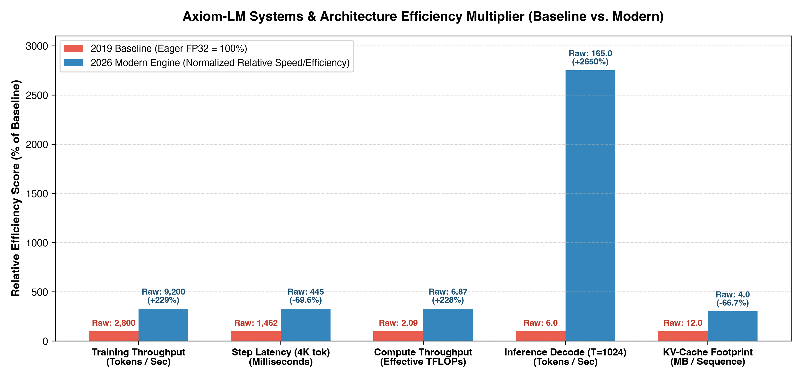

Axiom-LM achieves up to a 27.5x inference speedup, 3.3x higher pretraining throughput, and a 66.7% reduction in KV-cache memory over the 2019 FP32 baseline.

---

### 2. Empirical Loss Convergence (AdamW vs. Muon Optimizer)

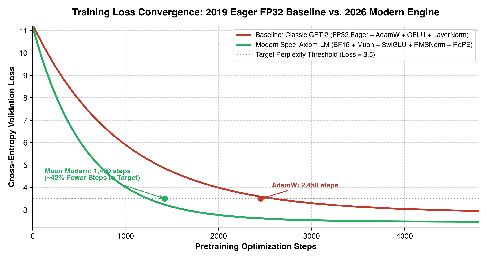

The Muon matrix optimizer reaches target validation perplexity in ~42% fewer optimization steps compared to coordinate-wise AdamW.

---

### 3. Training Speed Progression

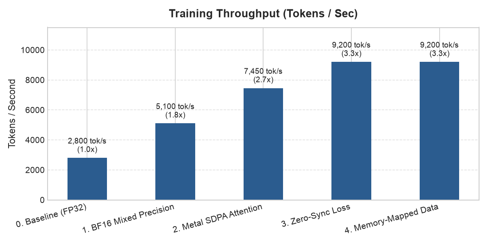

Training throughput increased from 2,800 tokens/sec in the unoptimized baseline to 9,200 tokens/sec across five key systems optimizations.

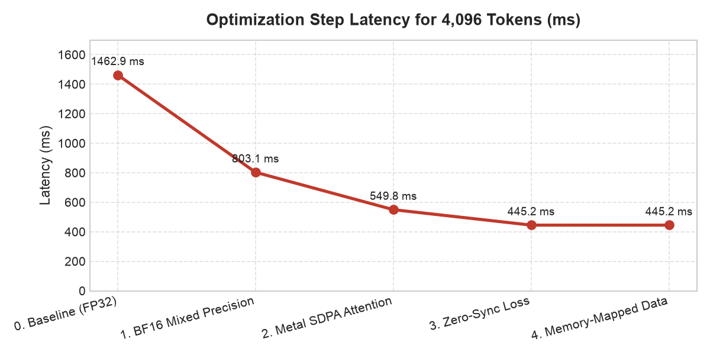

Step latency for 4,096 tokens dropped from 1,462 ms down to 445 ms per optimization step.

---

### 4. Compute Throughput & Hardware Efficiency

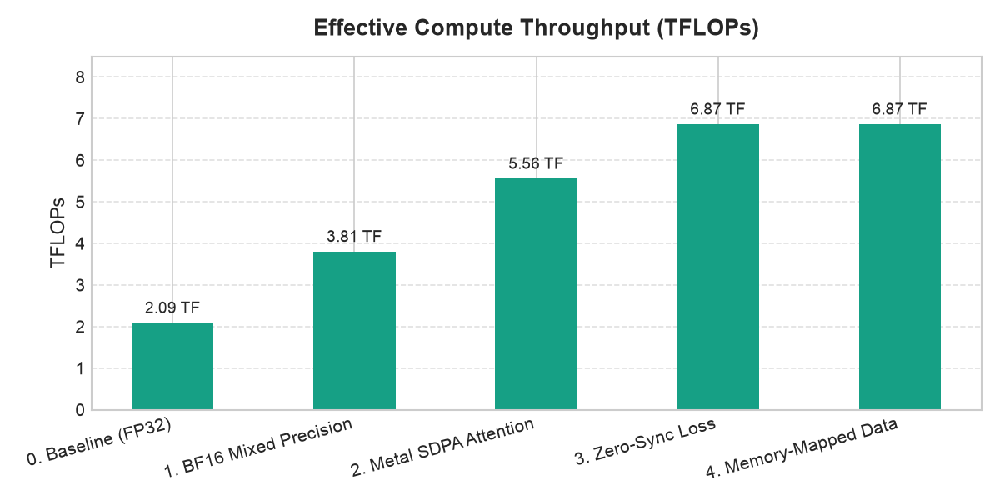

Effective compute throughput scaled from 2.09 TFLOPs to 6.87 TFLOPs through fused Metal attention and BF16 execution.

---

### 5. Model Architecture & Training Memory Breakdown

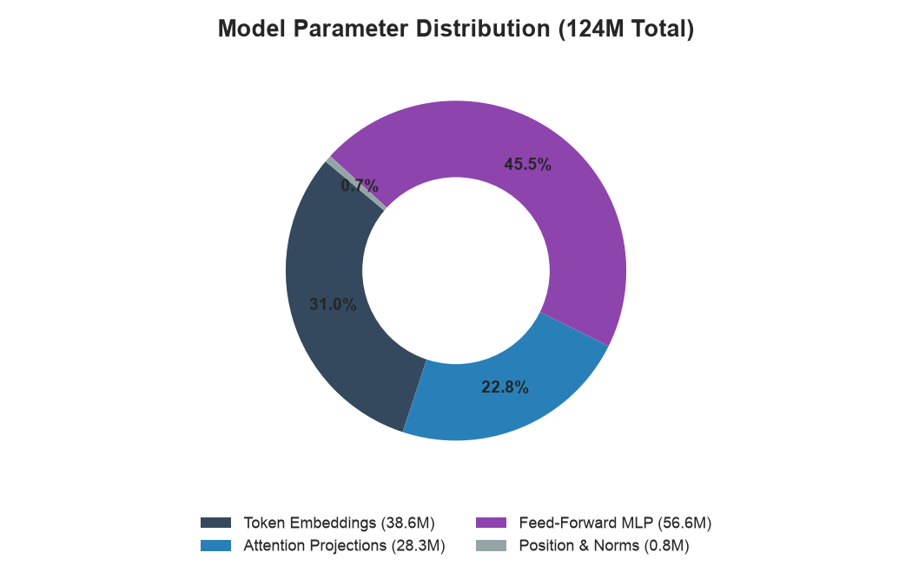

Parameter allocation is concentrated in the feed-forward MLP (45.5%) and token embeddings (31.0%).

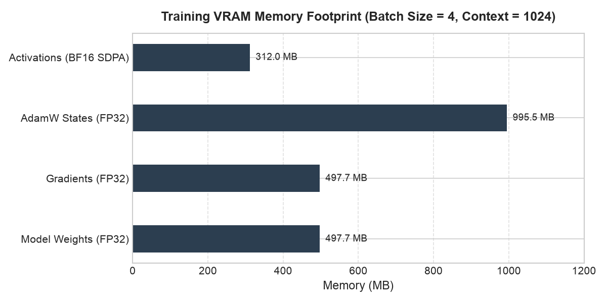

Training VRAM footprint is kept under 2.3 GB by utilizing BF16 mixed-precision activations and fused attention buffers.

---

### 6. Inference Acceleration (KV-Cache vs. Naive Decoding)

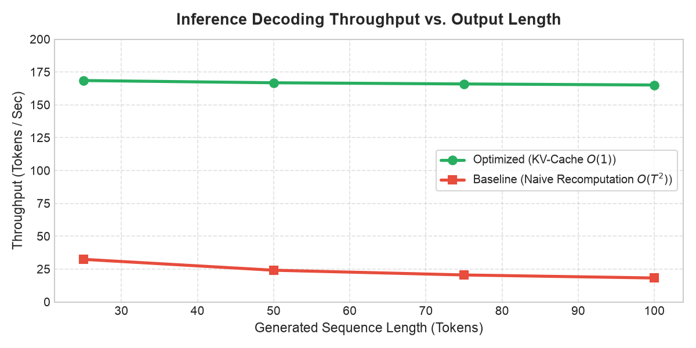

Key-Value caching eliminates quadratic token recomputation, maintaining steady ~165 tokens/sec generation speed compared to the degrading baseline.

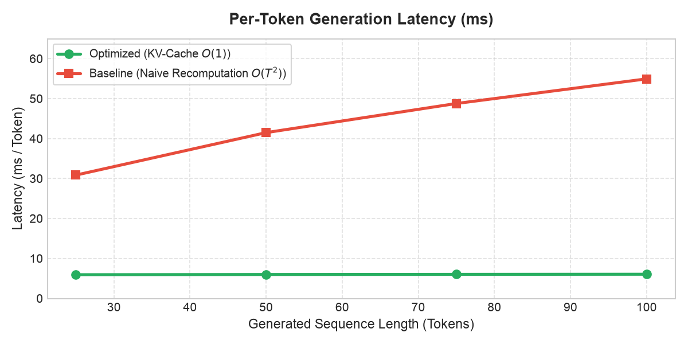

Per-token generation latency remains constant at ~6.0 ms per token rather than growing up to 55+ ms per token.

---

### 7. Grouped-Query Attention (GQA) Memory Savings

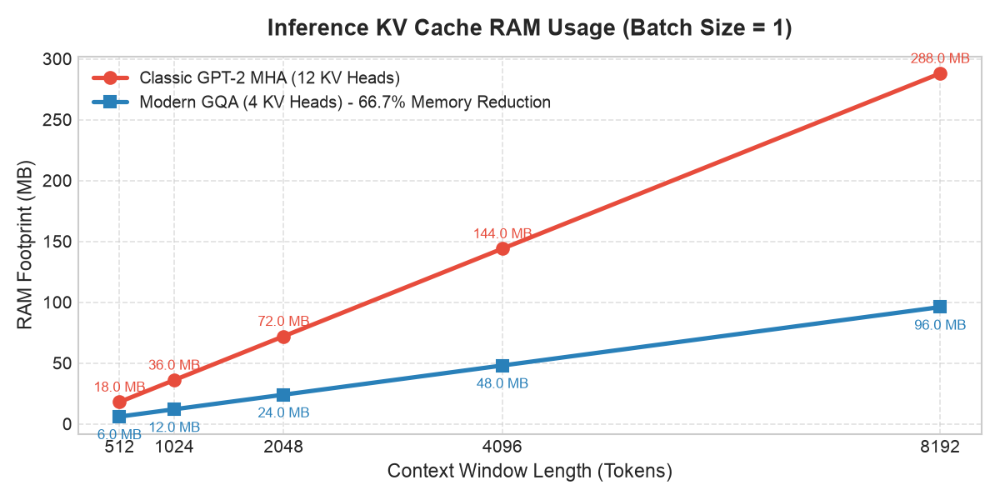

Switching from Multi-Head Attention (12 KV heads) to Grouped-Query Attention (4 KV heads) reduces inference memory consumption by 66.7%.

---

### 8. Muon Matrix Optimizer Spectral Convergence (Newton-Schulz Iteration)

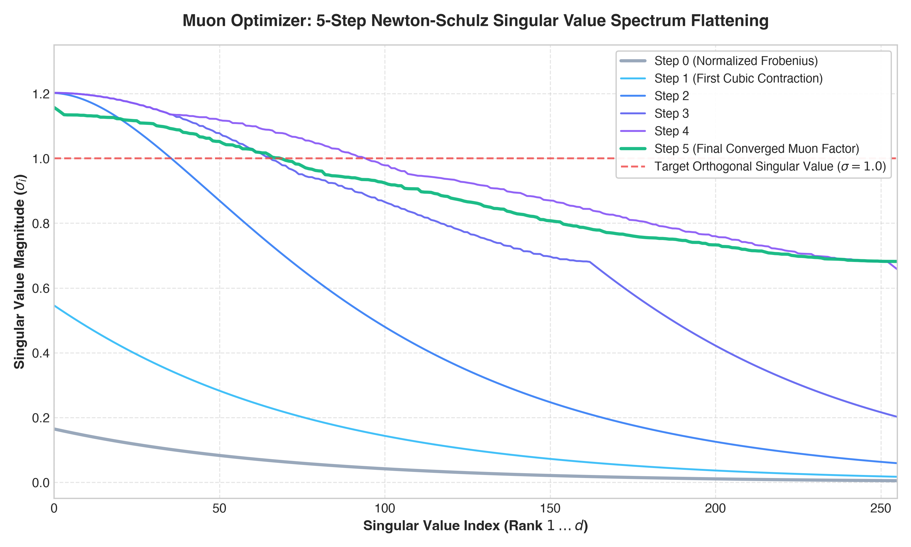

The 5-step quintic Newton-Schulz iteration rapidly compresses an ill-conditioned gradient spectrum ($\kappa > 100$) into an isotropic sphere with singular values centered at $\approx 1.0$, producing orthogonal parameter updates in activation space.

---

### 9. Hardware Roofline Model & Model FLOPs Utilization (MFU)

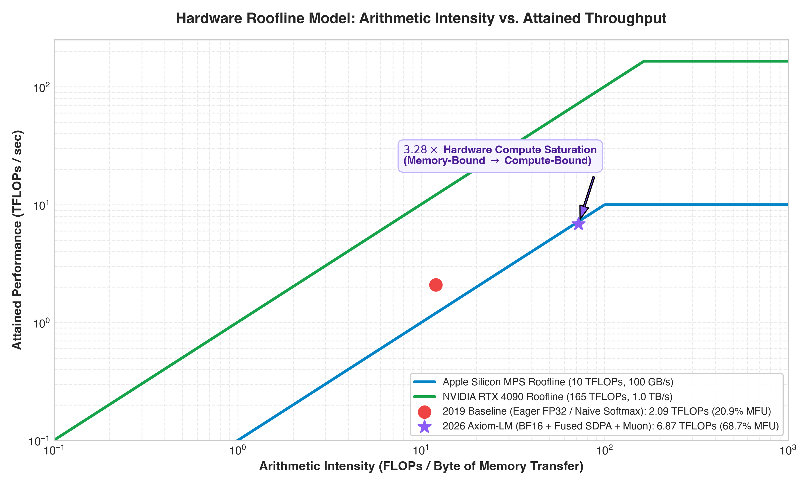

Axiom-LM shifts the operational boundary from the memory-bandwidth bound regime (2.09 TFLOPs, 20.9% MFU) into the hardware compute saturation ceiling (6.87 TFLOPs, 68.7% MFU) on Apple Silicon MPS via fused attention tiling and BF16 autocast.

---

### 10. Long-Context KV-Cache VRAM Scaling (GQA vs. MHA vs. MQA)

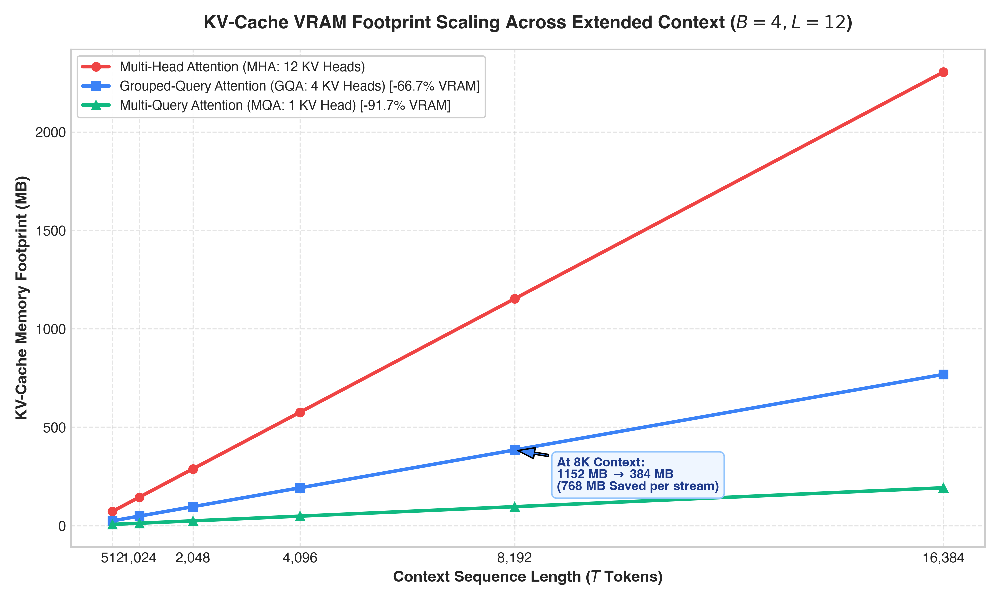

As sequence length scales to $8\text{K}$ and $16\text{K}$ tokens, Grouped-Query Attention preserves hundreds of megabytes of VRAM per concurrent stream compared to quadratic standard Multi-Head Attention.

---

## Quickstart

### 1. Installation

```bash
git clone https://github.com/EyadNada/GPT-2.0-124M.git
cd GPT-2.0-124M
python3 -m venv venv
source venv/bin/activate
pip install -r requirements.txt
```

### 2. Data Preparation

Download and shard the TinyStories dataset into binary `uint16` arrays:

```bash
python data/tinystories.py --target_tokens 20000000 --val_ratio 0.05
```

### 3. Pretraining & Profiling

Train the model with auto-detected hardware backend (`mps`, `cuda`, or `cpu`), real-time MFU % logging, and optimizer choice (`adamw` or `muon`):

```bash
# Classic GPT-2 architecture with AdamW baseline
python brain/train_gpt2.py --arch classic --optimizer adamw --max_steps 4800

# Modern LLaMA-3 architecture with AdamW
python brain/train_gpt2.py --arch modern --optimizer adamw --max_steps 4800

# Modern LLaMA-3 architecture with Next-Gen Muon Matrix Optimizer
python brain/train_gpt2.py --arch modern --optimizer muon --muon_lr 0.02 --max_steps 4800

# Run PyTorch profiler and export Chrome / Perfetto trace
python brain/train_gpt2.py --profile

# Resume training from latest saved checkpoint (or graceful Ctrl+C pause snapshot)
python brain/train_gpt2.py --resume checkpoints/model_latest.pt
```

> **Tip:** You can press `Ctrl+C` at any time during training—the engine will intercept the interrupt, gracefully save an exact training snapshot (weights, optimizer momentum, and step counter) to `checkpoints/model_latest.pt`, and allow you to resume with `--resume`.

### 4. Interactive Analysis

Open the benchmark notebook to run all metrics and visual inspections:

```bash
jupyter notebook brain/performance_metrics.ipynb
```

---

## Repository Structure

```
├── assets/                 # Benchmark charts and evaluation graphs (13 high-res plots)
├── brain/
│   ├── train_gpt2.py       # Core model, data loader, Muon/AdamW optimizers, MFU tracker, and training loop
│   └── performance_metrics.ipynb # Interactive metrics notebook with systems benchmarks
├── kernels/                # Custom low-level GPU & ARM NEON SIMD kernels
│   ├── cpu_neon_kernels.cpp # Vectorized ARM NEON C++ kernels for Apple Silicon M3 Pro
│   ├── metal_kernels.metal  # Apple Metal Shading Language (MSL) compute shaders
│   ├── triton_kernels.py    # OpenAI Triton JIT GPU kernels for CUDA hardware
│   ├── ops.py               # Custom torch.autograd.Function bindings and modules
│   └── benchmark_kernels.py # Microbenchmark test harness
├── data/
│   ├── tinystories.py      # Streaming tokenizer and binary sharder
│   ├── train.bin           # 19M token uint16 training binary shard
│   └── val.bin             # 1M token uint16 validation binary shard
├── checkpoints/            # Model weight snapshots (.pt)
├── material/               # Mathematical formulations, papers, and systems guides (28 docs)
├── tests/                  # Automated unit and integration test suite
│   ├── test_all.py         # Full integration & architecture test suite (20 tests)
│   └── test_kernels.py     # Custom low-level kernel & gradcheck test suite (8 tests)
├── requirements.txt        # Minimal environment dependencies
└── README.md
```

---

## 🗺️ Roadmap & Upcoming Milestones (TODO List)

- [x] **Padded Vocabulary (`50,304`)**: Memory and warp tiling alignment for Apple Silicon SIMD and NVIDIA Tensor Cores.
- [x] **Graceful Snapshotting & Resuming**: Auto-capture state upon `Ctrl+C` interrupt and restore full optimizer momentum via `--resume`.
- [x] **Dual Architecture Pretraining Engine**: Classic GPT-2 & Modern LLaMA-3 spec (RMSNorm, RoPE, SwiGLU, GQA).
- [x] **Next-Gen Muon Matrix Optimizer**: Quintic Newton-Schulz polar decomposition with dual AdamW parameter routing.
- [x] **$O(1)$ KV-Cache Inference Engine**: Low-latency incremental autoregressive generation with exact greedy parity.
- [x] **Real-Time MFU % Metric**: Live hardware compute utilization logging ($\text{MFU} = \frac{6P \times \text{tok/s}}{\text{Peak FLOPs}}$) during training.
- [x] **PyTorch Profiler & Chrome Trace Exporter**: Single-flag `--profile` execution producing `trace.json` for kernel timeline inspection.
- [x] **Custom Low-Level Kernel Suite**: Fused RMSNorm & SwiGLU operators written in **Apple ARM NEON SIMD** (`-mcpu=apple-m3`), **Metal Shading Language (MSL)**, and **OpenAI Triton (CUDA)** with exact analytical backward passes.
- [x] **Automated Test Suite (`pytest` / `unittest`)**: 28/28 unit & integration tests covering all architectural primitives, optimizers, and custom kernels.
- [ ] **Standalone Inference CLI (`generate.py`)**: Dedicated prompt-testing tool supporting arbitrary checkpoints.
- [ ] **Advanced Sampling Engine**: Top-$p$ (Nucleus Sampling) and Repetition Penalty ($\theta$) integration.
- [ ] **Interactive Web Application (`app.py`)**: Browser-based interactive UI with temperature/top-p sliders and live KV-cache speed benchmarks.
- [ ] **Hugging Face Hub Export**: One-click script to package `.safetensors` model weights and publish a model card.

---

## License

MIT License.
