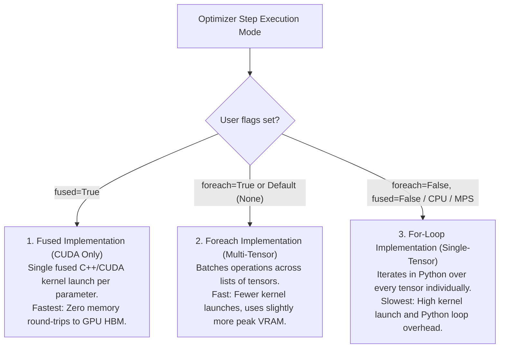

# AdamW Optimizer Guide & Documentation

This document provides a comprehensive reference for **`torch.optim.AdamW`**, explaining the mathematical algorithm, the difference between Adam and AdamW (Decoupled Weight Decay), and how it is configured and applied when training **GPT-2 (124M)**.

---

## 1. PyTorch Class Signature

*(Reference: [PyTorch `torch.optim.AdamW`](https://pytorch.org/docs/stable/generated/torch.optim.AdamW.html))*

```python
torch.optim.AdamW(
    params,
    lr=1e-3,
    betas=(0.9, 0.999),
    eps=1e-8,
    weight_decay=1e-2,
    amsgrad=False,
    *,
    maximize=False,
    foreach=None,
    capturable=False,
    differentiable=False,
    fused=None
)
```

### Parameter Reference Table

| Parameter | Type | Default | Description |
|:---|:---:|:---:|:---|
| **`params`** | `iterable` | *required* | Iterable of parameters to optimize or dicts defining parameter groups. |
| **`lr`** | `float` | `1e-3` | Learning rate ($\gamma$ or $\alpha$). In GPT-2 (124M): starts at `6e-4` with cosine decay. |
| **`betas`** | `Tuple[float, float]` | `(0.9, 0.999)` | Coefficients $(\beta_1, \beta_2)$ for running averages of gradient and squared gradient. For GPT-2: `(0.9, 0.95)`. |
| **`eps`** | `float` | `1e-8` | Term added to denominator to improve numerical stability ($\epsilon$). |
| **`weight_decay`** | `float` | `1e-2` | Decoupled weight decay coefficient ($\lambda$). In GPT-2: `0.1` (applied only to 2D weight tensors). |
| **`amsgrad`** | `bool` | `False` | Whether to use the AMSGrad variant from the paper *On the Convergence of Adam and Beyond*. |
| **`maximize`** | `bool` | `False` | Maximize the objective with respect to params instead of minimizing. |
| **`foreach`** | `bool / None` | `None` | Whether the multi-tensor "foreach" implementation is used. Significantly faster than for-loop on CUDA by batching kernel launches over tensor lists. Uses $\sim \text{sizeof(params)}$ more peak memory. |
| **`capturable`** | `bool` | `False` | Whether this instance is safe to capture in a CUDA graph. Passing `True` can impair ungraphed performance. |
| **`differentiable`** | `bool` | `False` | Whether autograd should track optimizer steps. If `False`, `step()` runs inside `torch.no_grad()`. |
| **`fused`** | `bool / None` | `None` | Whether the fused implementation (CUDA only) is used. Supports `float64`, `float32`, `float16`, and `bfloat16`. Fuses math into a single CUDA kernel. |

---

## 2. Optimizer Implementations: Fused vs. Foreach vs. For-Loop

PyTorch provides three underlying execution paths for AdamW on CUDA:

```
[Speed Ranking]:   Fused  >  Foreach  >  For-Loop (Single Tensor)
```



### Key Differences & Behavior:

1. **`fused` (Fastest — CUDA Only)**:
   - Fuses momentum, variance, weight decay, and parameter update operations into **a single fused CUDA C++ kernel per parameter**.
   - **Benefit**: Avoids writing intermediate tensors back and forth to GPU high-bandwidth memory (HBM/VRAM).
   - **Supported Dtypes**: `torch.float32`, `torch.bfloat16`, `torch.float16`, and `torch.float64`.
   - **Why not default?**: It is newer and has had less "bake-in" time in PyTorch, so PyTorch defaults to `foreach` unless `fused=True` is explicitly passed.

2. **`foreach` (Multi-Tensor — Default on CUDA)**:
   - Uses PyTorch's `_foreach_*` multi-tensor C++ APIs to apply vector math across entire lists of tensors in fewer kernel dispatches.
   - Faster than standard for-loops, but allocates a small amount of extra peak memory ($\sim \text{sizeof(params)}$) for tensor lists.

3. **`for-loop` (Fallback — Single Tensor / CPU / MPS)**:
   - Standard Python loop iterating through each parameter tensor one-by-one.
   - Used on CPU, Apple Silicon (MPS), or when `foreach=False` and `fused=False`.

---

## 3. The Core Mathematical Algorithm

AdamW implements the algorithm from **Loshchilov & Hutter (2017/2019)**: *"Decoupled Weight Decay Regularization"*.

### Step-by-Step Algorithm (at time step $t$):

Given gradient $g_t = \nabla_\theta f_t(\theta_{t-1})$:

1. **Decoupled Weight Decay Step:**
   $$\theta_t \leftarrow \theta_{t-1} - \gamma \lambda \theta_{t-1}$$
   *(The parameters shrink directly by a fraction of their current value, completely independent of the gradient).*

2. **Update Biased 1st Moment (Mean):**
   $$m_t \leftarrow \beta_1 m_{t-1} + (1 - \beta_1) g_t$$

3. **Update Biased 2nd Raw Moment (Uncentered Variance):**
   $$v_t \leftarrow \beta_2 v_{t-1} + (1 - \beta_2) g_t^2$$

4. **Compute Bias-Corrected Moments:**
   $$\widehat{m}_t \leftarrow \frac{m_t}{1 - \beta_1^t}, \qquad \widehat{v}_t \leftarrow \frac{v_t}{1 - \beta_2^t}$$

5. **Apply Gradient Step:**
   $$\theta_t \leftarrow \theta_t - \frac{\gamma \widehat{m}_t}{\sqrt{\widehat{v}_t} + \epsilon}$$

---

## 4. Why AdamW instead of Standard Adam? (L2 Regularization vs. True Weight Decay)

In standard SGD, L2 regularization ($\frac{1}{2}\lambda \|\theta\|^2$) is mathematically identical to weight decay.

However, in adaptive optimizers like **Adam**:
- **Standard Adam with L2 Penalty:** 
  The L2 penalty adds $\lambda \theta$ directly to the gradient: $g_t' = g_t + \lambda \theta$.
  Then $g_t'$ is divided by $\sqrt{v_t}$.
  - **Problem:** Weights with historically large gradients get divided by a large $\sqrt{v_t}$, which **suppresses their weight decay penalty**.
  - Weights with small gradients get decayed **much more aggressively**.
- **AdamW (Decoupled Weight Decay):**
  Weight decay is subtracted directly from $\theta$ ($\theta \leftarrow \theta - \gamma \lambda \theta$) **before** the adaptive gradient update step.
  - **Result:** Every weight decays at a constant proportional rate $\gamma \lambda$, restoring proper regularization for Transformers and yielding significantly better validation loss and generalization.

---

## 5. Usage in GPT-2 (124M)

### A. Simple Optimization Loop (Overfitting a Single Batch)

As demonstrated in Karpathy's video at ~57:30:

```python
import torch

# 1. Instantiate model and optimizer
model = GPT(GPTConfig())
model.to(device)
model.train()

optimizer = torch.optim.AdamW(model.parameters(), lr=3e-4, betas=(0.9, 0.95), eps=1e-8)

# 2. Overfitting loop
for step in range(50):
    optimizer.zero_grad()
    logits, loss = model(x, y)
    loss.backward()
    optimizer.step()
    print(f"step {step:2d} | loss: {loss.item():.6f}")
```

---

### B. Production Setup: Parameter Groups & Selective Weight Decay

In GPT-2 / modern LLMs, weight decay should **NOT** be applied to:
- 1D tensors (e.g. LayerNorm scale/bias weights `weight`, `bias`)
- Embedding position/token biases
- Linear layer biases

It should **ONLY** be applied to:
- 2D matrix weights (Linear transformations $W_{qkv}, W_{proj}, W_{fc}$ and token/position embeddings).

```python
def configure_optimizers(model, weight_decay=0.1, learning_rate=6e-4, betas=(0.9, 0.95), device_type='cuda'):
    # Separate parameters into decayed (2D matrices) and non-decayed (1D biases, layernorms)
    decay_params = [p for n, p in model.named_parameters() if p.requires_grad and p.dim() >= 2]
    nodecay_params = [p for n, p in model.named_parameters() if p.requires_grad and p.dim() < 2]

    optim_groups = [
        {'params': decay_params, 'weight_decay': weight_decay},
        {'params': nodecay_params, 'weight_decay': 0.0}
    ]
    
    num_decay_params = sum(p.numel() for p in decay_params)
    num_nodecay_params = sum(p.numel() for p in nodecay_params)
    print(f"Decayed parameter tensors: {len(decay_params)} ({num_decay_params:,} parameters)")
    print(f"Non-decayed parameter tensors: {len(nodecay_params)} ({num_nodecay_params:,} parameters)")

    # Use fused kernel if available on CUDA
    fused_available = 'fused' in inspect.signature(torch.optim.AdamW).parameters
    use_fused = fused_available and device_type == 'cuda'
    extra_args = dict(fused=True) if use_fused else dict()

    optimizer = torch.optim.AdamW(optim_groups, lr=learning_rate, betas=betas, eps=1e-8, **extra_args)
    return optimizer
```

---

## 6. Summary of Recommended GPT-2 (124M) Settings

| Setting | GPT-2 Value | Notes |
|:---|:---:|:---|
| **Peak Learning Rate** | `6e-4` | Scaled with cosine decay schedule down to `6e-5` (10%). |
| **Warmup Steps** | ~`715` steps | Linearly increases from $0$ to `6e-4` (approx. 375M tokens). |
| **Betas** | `(0.9, 0.95)` | $\beta_2 = 0.95$ is preferred over standard $0.999$ for LLM stability. |
| **Epsilon ($\epsilon$)** | `1e-8` | Prevents division by zero. |
| **Weight Decay** | `0.1` | Applied only to 2D tensors ($\ge 2$ dimensions). |
| **Gradient Clipping** | `1.0` | `torch.nn.utils.clip_grad_norm_(model.parameters(), 1.0)` prevents exploding gradients. |
