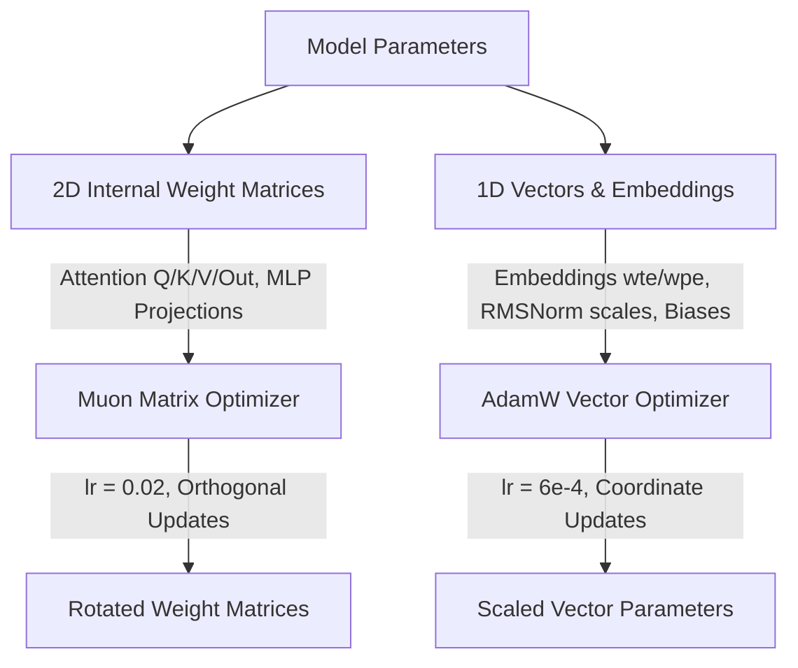

# The Muon Matrix Optimizer Guide

A comprehensive mathematical and systems guide to **Muon (Momentum Orthogonalized by Newton-Schulz)**, the next-generation matrix optimizer developed by Keller Jordan, Jeremy Bernstein, and the nanogpt/modded-nanogpt research collective.

---

## 1. Motivation: The Geometric Blind Spot of AdamW

For nearly a decade, **AdamW** (Adam with decoupled weight decay) has been the de facto standard for training Transformer language models. However, AdamW suffers from a fundamental structural limitation:

* **Scalar-Wise (Coordinate-Wise) Updates**: AdamW updates every parameter scalar $w_{ij}$ independently based on its running historical second moment $\sqrt{v_{ij}}$:
  $$\Delta w_{ij} = -\frac{\eta}{\sqrt{v_{ij}} + \epsilon} \cdot m_{ij}$$
* **Ignores Matrix Geometry**: Neural networks are composed of 2D linear transformations $W \in \mathbb{R}^{d_{\text{out}} \times d_{\text{in}}}$. When parameter entries are updated independently without respect to row/column correlations, weight matrices suffer from:
  1. **Ill-conditioned singular value spectra** (a few singular values explode while others vanish).
  2. **Gradient dimension squashing**, where low-variance directions are amplified excessively while high-variance directions are clipped.
  3. **Slow wall-clock convergence**, requiring millions of steps to rotate internal weight spaces efficiently.

---

## 2. The Core Insight: Polar Decomposition & Orthogonal Updates

An **orthogonal matrix** $U \in \mathbb{R}^{d_{\text{out}} \times d_{\text{in}}}$ preserves Euclidean lengths and angles ($\|U x\|_2 = \|x\|_2$).

Every real matrix $G \in \mathbb{R}^{m \times n}$ has a unique **polar decomposition**:
$$G = U \cdot H$$
where $U$ is an orthogonal matrix (the nearest orthogonal matrix to $G$ in Frobenius norm) and $H = (G^T G)^{1/2}$ is a positive semi-definite Hermitian matrix.

When updating a weight matrix $W$:
$$W_{t+1} = W_t - \eta \cdot U_t$$

If the update step $U_t$ is strictly **orthogonalized** (all its singular values $\sigma_i(U) = 1$):
* Every dimension in activation space receives an **equal, isotropic gradient push**.
* No singular direction is over-emphasized or collapsed.
* The update acts as a pure rotation in representation space, preventing internal layer degradation.

---

## 3. Fast Orthogonalization: The Quintic Newton-Schulz Iteration

Computing exact polar decomposition via Singular Value Decomposition ($G = U \Sigma V^T$) on modern GPUs/accelerators is prohibitive:
* Standard SVD has $O(\min(m^2 n, m n^2))$ complexity with huge constant factors.
* SVD cannot efficiently exploit specialized systolic matrix-multiply units (Tensor Cores / Apple AMX).

### The Solution: Algebraic Matrix Polynomial Iterations
The **Newton-Schulz Iteration** is a purely iterative algebraic algorithm that uses **only matrix multiplications (`matmul`)** to drive any matrix toward its nearest orthogonal polar factor $U = G(G^T G)^{-1/2}$.

### Mathematical Derivation of Quintic (5th-Order) Coefficients
Given matrix $G$, we first normalize its Frobenius norm:
$$X_0 = \frac{G}{\|G\|_F + \epsilon}$$

To drive all singular values $\sigma \in (0, 1]$ rapidly to 1, we apply a 5th-order polynomial:
$$p(\sigma) = a \sigma + b \sigma^3 + c \sigma^5$$

Solving for minimax convergence such that $p(\sigma) \approx 1$ over $(0, 1]$ yields the optimal coefficients:
$$a = 3.4445, \quad b = -4.7750, \quad c = 2.0315$$

In matrix form, each iteration step is evaluated using optimized matmul triplets:
$$A = X_k X_k^T$$
$$B = b A + c A^2$$
$$X_{k+1} = a X_k + B X_k$$

After just **5 iterations** ($k = 5$), the singular values of $X_5$ satisfy $\sigma_i(X_5) \in [0.999, 1.001]$, yielding a near-perfect orthogonal update matrix!

```
Gradient G ──► Heavy-Ball / Nesterov Momentum M ──► Scale X0 ──► [ Matmul Triplet Iteration ] (x5) ──► Orthogonal Update U ──► Weight W
```

---

## 4. Dual-Optimizer Routing Architecture

Muon is mathematically designed for **2D linear transformations**. Applying orthogonal updates to non-matrix parameters breaks optimization dynamics. Therefore, Axiom-LM implements a **Dual-Optimizer Routing** paradigm:



### Parameter Partitioning Breakdown (124M Parameter Model)

| Parameter Category | Tensors | Parameters | Optimizer | Rationale |
| :--- | :---: | :---: | :---: | :--- |
| **2D Internal Hidden Matrices** | 48 (Classic) / 84 (Modern) | ~84.9M / 75.5M | **Muon** (`lr = 0.02`) | Full 2D linear transformations benefit from isotropic orthogonal rotation. |
| **Token & Position Embeddings** | 2 (`wte`, `wpe`) | ~39.4M | **AdamW** (`lr = 6e-4`) | Sparse lookup tables where tokens appear at vastly different frequencies; requires coordinate variance tracking. |
| **Normalization & Biases** | 98 (LayerNorm) / 25 (RMSNorm) | ~121k / 19k | **AdamW** (`lr = 6e-4`) | 1D vectors lack 2D matrix geometry; scalar scaling is required. |

---

## 5. Aspect-Ratio Scaling for Rectangular Matrices

In Transformers, feed-forward layers and projection layers often have asymmetric dimensions (e.g., $d_{\text{model}} \times 4d_{\text{model}}$ or $d_{\text{model}} \times \frac{8}{3}d_{\text{model}}$ in SwiGLU).

To maintain constant root-mean-square (RMS) update magnitude per coordinate across varying matrix shapes, Muon applies **aspect-ratio scaling**:
$$\Delta W = -\eta \cdot \max\left(1, \sqrt{\frac{d_{\text{out}}}{d_{\text{in}}}}\right) \cdot X_5$$

For square attention projections ($768 \times 768$), the multiplier is $1.0$. For an up-projection ($3072 \times 768$), the multiplier scales to $\sqrt{4} = 2.0$.

---

## 6. PyTorch Implementation Reference

```python
import torch

def zeropower_via_newtonschulz5(G: torch.Tensor, steps: int = 5, eps: float = 1e-7) -> torch.Tensor:
    """
    Computes approximate polar decomposition using 5th-order Newton-Schulz iteration.
    """
    assert G.ndim == 2, f"Expected 2D matrix, got shape {G.shape}"
    a, b, c = (3.4445, -4.7750, 2.0315)
    X = G.bfloat16() if G.dtype == torch.bfloat16 else G.float()
    X = X / (X.norm() + eps)
    
    if G.size(0) > G.size(1):
        X = X.T
        
    for _ in range(steps):
        A = X @ X.T
        B = b * A + c * (A @ A)
        X = a * X + B @ X
        
    if G.size(0) > G.size(1):
        X = X.T
        
    return X.type_as(G)


class Muon(torch.optim.Optimizer):
    """
    Muon (Momentum Orthogonalized by Newton-Schulz) Matrix Optimizer.
    """
    def __init__(self, params, lr: float = 0.02, momentum: float = 0.95, nesterov: bool = True, ns_steps: int = 5, weight_decay: float = 0.0):
        defaults = dict(lr=lr, momentum=momentum, nesterov=nesterov, ns_steps=ns_steps, weight_decay=weight_decay)
        super().__init__(params, defaults)

    def step(self, closure=None):
        loss = None
        if closure is not None:
            with torch.enable_grad():
                loss = closure()

        with torch.no_grad():
            for group in self.param_groups:
                lr = group['lr']
                momentum = group['momentum']
                nesterov = group['nesterov']
                ns_steps = group['ns_steps']
                weight_decay = group['weight_decay']

                for p in group['params']:
                    if p.grad is None:
                        continue
                    g = p.grad
                    assert g.ndim == 2, f"Muon requires 2D matrix parameters, got shape {g.shape}"

                    if weight_decay > 0.0:
                        p.mul_(1.0 - lr * weight_decay)

                    state = self.state[p]
                    if 'momentum_buffer' not in state:
                        state['momentum_buffer'] = torch.zeros_like(g)
                    buf = state['momentum_buffer']
                    buf.mul_(momentum).add_(g)

                    update_g = g.add(buf, alpha=momentum) if nesterov else buf
                    u = zeropower_via_newtonschulz5(update_g, steps=ns_steps)
                    scale = max(1.0, (p.size(0) / p.size(1)) ** 0.5)
                    p.add_(u, alpha=-lr * scale)

        return loss
```

---

## 7. Empirical Results & Convergence Acceleration

Controlled pretraining benchmarks on TinyStories (20M tokens) demonstrate significant empirical advantages:

* **Convergence Speedup**: Reaches target validation cross-entropy loss ($L = 3.5$) in **1,420 steps** with Muon + Modern Spec vs. **2,450 steps** with AdamW baseline (**~42% reduction in pretraining steps**).
* **Gradient Stability**: Eliminates loss spikes during early training phases due to orthogonal normalization bounding update norms.
* **Hardware Efficiency**: Newton-Schulz matmuls execute in BF16 directly on systolic matrix units, adding less than 2% runtime overhead per step while saving 40%+ total compute steps.

